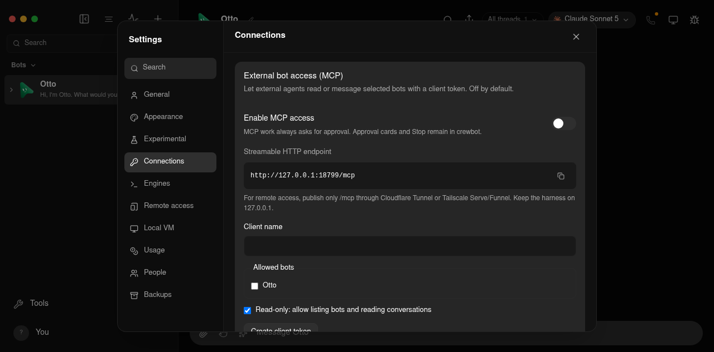
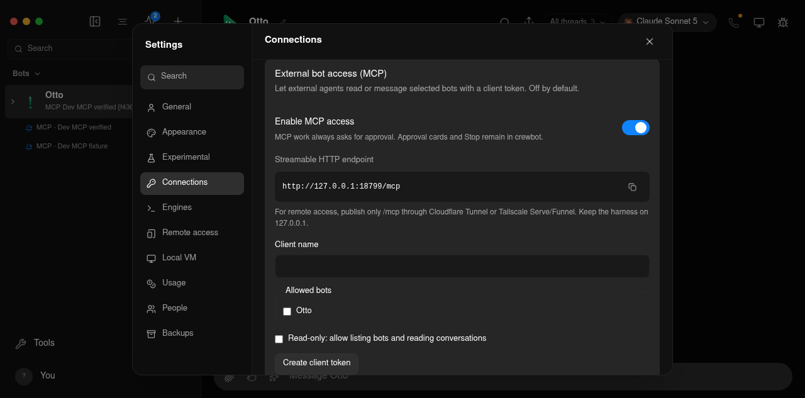

# External bot MCP acceptance

Follow [the fixture rules](README.md) and [development stack isolation](development-stack.md).
Never enable this endpoint, issue credentials, or send messages against installed
stable data or the user's development workspace. Product setup and remote
publishing instructions are in [External bot access](../mcp-bot-access.md).

## Automated acceptance

```sh
pnpm exec vitest run server/bot-mcp.e2e.test.ts server/mcp-access.test.ts server/mcp-server.test.ts server/request-auth.test.ts server/store.test.ts server/redact.test.ts server/permission-proxy.test.ts server/drivers/claude.test.ts server/workspace-backup-policy.test.ts server/workspace-backup.test.ts
pnpm lint
pnpm typecheck
pnpm i18n:check
pnpm test:electron
```

`bot-mcp.e2e.test.ts` launches a new `launchVerificationServer` fixture for
each test. Its HOME, data, API/webhook ports and fake Claude CLI are disposable.
It uses the repository's real `RemoteMcpClient` for Streamable HTTP initialize,
notifications, tool discovery and calls. It checks:

- Off by default; Settings requires an owner and same-origin mutation.
- A valid client sees only allowlisted bot metadata, receives a complete reply,
  and reads recent messages and memory. Durable request ids prevent duplicate sends.
- Missing, invalid and revoked bearers fail, including after initialization.
  Disabling access blocks a previously valid client. Credentials persist only
  as hashes, and ordinary owner API routes refuse MCP tokens.
- Read-only clients can list/read but cannot send. Foreign bots and threads fail,
  with no transcript mutation on a forbidden bot.
- A bot whose default is Auto runs an MCP thread in Ask mode. A real broker
  request produces the existing approval card; the caller remains pending and
  the broker receives no answer until the owner approves. The reply completes
  after approval. MCP-origin capabilities cannot open or delegate other threads.

The fake provider's gate holds its reply until the broker test receives the
human approval. It proves the harness, broker, card and HTTP wait boundaries;
it does not claim that a hosted model was called. Store tests also check that
MCP origin survives reload and stays out of the public task projection.

## Dev Settings and Streamable HTTP smoke

Use the development-stack recipe to allocate separate temporary `home`, `data`,
`profile`, `cache`, `portless` and `evidence` directories. Set
`CREWBOT_DEV_PORT=18799` and `CREWBOT_DEV_WEBHOOK_PORT=18800` only after checking
those ports are free. Start an owned Portless proxy and `pnpm dev:all` with a
whitelisted environment: PATH, the necessary display/session variables,
disposable HOME and XDG config/data roots, the fixture development paths,
`PORTLESS_STATE_DIR`, `PORTLESS_PORT` and `PORTLESS_SYNC_HOSTS=0`.
Include `FAKE_CLAUDE_MODE=happy`; inherit no provider credentials.

After the fixture API is ready, explicitly select its fake Claude CLI through
`PATCH http://127.0.0.1:18799/api/instances/claude` with JSON
`{"cli":"ABSOLUTE_REPO_PATH/server/testing/fake-claude-cli.ts"}`.
Seeded instance settings may be normalized during initial configuration, so
check the running instance after setting it. This avoids invoking a signed-out
installed CLI or using an installed provider login. Use a fixture bot assigned
to this Claude instance.

In the fixture renderer, pair this browser using the fixture's pairing code
when requested. Open Settings → Connections, check that MCP is off, enable it,
and create a client named `Dev MCP verified`, allowing only the fixture bot.
Clear read-only for this send test. Save the displayed token to a private
`0600` file in the fixture root, then dismiss it. Verify the token is absent
from subsequent Settings reads. Capture screenshots before enablement and
after dismissal; never capture a bearer.

From the repository root, use a real MCP client with the private token file:

```sh
# MCP_FIXTURE_TOKEN_FILE is the absolute private file in this disposable fixture.
node --experimental-strip-types --input-type=module <<'JS'
import { readFileSync } from "node:fs";
import assert from "node:assert/strict";
import { RemoteMcpClient } from "./server/mcp-http.ts";
const url = "http://127.0.0.1:18799/mcp";
const token = readFileSync(process.env.MCP_FIXTURE_TOKEN_FILE, "utf8").trim();
const client = new RemoteMcpClient({ type: "http", url, headers: { authorization: `Bearer ${token}` } });
const signal = AbortSignal.timeout(30_000);
await client.initialize("development-acceptance", signal);
const call = async (name, args) => {
  const result = await client.request("tools/call", { name, arguments: args }, signal);
  assert.equal(result.isError, undefined, result.content[0].text);
  return JSON.parse(result.content[0].text);
};
const listed = await call("list_bots", {});
assert.equal(listed.bots.length, 1);
const botId = listed.bots[0].id;
const sent = await call("send_message", { bot_id: botId, text: "MCP_DEV_SMOKE_REPLY", request_id: "dev-smoke-1" });
assert.ok(sent.reply);
const history = await call("get_thread", { bot_id: botId });
assert.ok(history.messages.some(m => m.role === "user" && m.text === "MCP_DEV_SMOKE_REPLY"));
console.log(JSON.stringify({ endpoint: url, listedBots: listed.bots.length, reply: sent.reply, threadId: sent.threadId, result: "passed" }));
await client.close();
JS
```

Revoke the fixture client, check its former bearer receives 401, disable MCP,
and check the endpoint receives 404. Close the browser and stop only the owned
stack/proxy process groups. Check that the fixture API/webhook ports are free
before removing its HOME, data, profile, cache and private token. Keep logs and
sanitized evidence. Do not invoke the stable API or modify its package/profile.

This source smoke covers Arch Linux x86_64 X11 with Electron and Chromium.
Public Cloudflare/Tailscale publication is documented but untested; it requires
the owner's network setup. Installed-package data/credential continuity and
Wayland behavior retain their existing separate gates. Native Android, iOS,
macOS and Windows acceptance remains deferred.

## Recorded source evidence

The 2026-10-09 run used source `8143d75ffec176c764ffc9088a4a5334ca57eb90` on base
`7faaa8907a9d0be48f640e108de52f0628289bce`.
[Exact checks and results](evidence/mcp-bot-access/checks.json),
[Streamable HTTP reply and transcript](evidence/mcp-bot-access/mcp-smoke.json),
[revocation/disable results](evidence/mcp-bot-access/cleanup-auth.json) and
[owned-process shutdown](evidence/mcp-bot-access/shutdown.json) record the scope.
Settings was enabled and a token issued through the actual dev renderer.
The smoke used a real MCP transport client and the repository fake engine.




